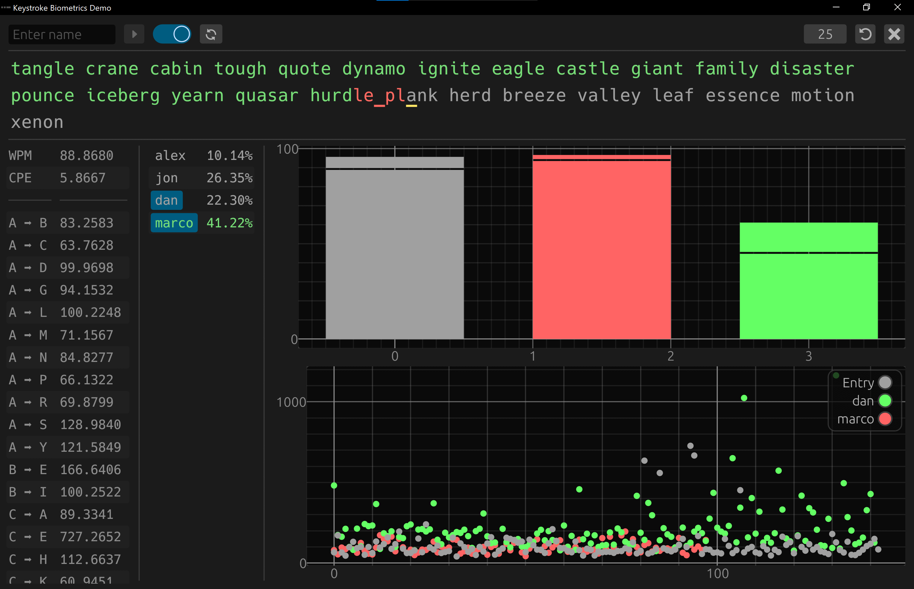

<h1>
  Keystroke Biometrics
</h1>

Rudimentary comparison between flight time, WPM, and CPE to determine who is typing. It directly compares the entry data with the closest match in a MySQL database. This project was built to learn <a href="https://diesel.rs/">Diesel ORM</a> and <a href="https://dev.mysql.com/">MySQL</a>.

  
What is Flight Time?

  
Flight time is the time it takes for a person to move from one key to the next while typing.

  
What is WPM?

  
Words Per Minute (WPM) is a common metric used to measure typing speed.

  
What is CPE?

  
Corrections Per Entry (CPE) is the ratio of corrections per characters typed.

  

<h1>
  Build
</h1>

> ### Requirements
> - <a href="https://www.rust-lang.org/tools/install">Rust</a>
> - <a href="https://diesel.rs/guides/getting-started">Diesel CLI</a>
> - <a href="https://dev.mysql.com/">MySQL</a>

After running `diesel setup`, you can run `cargo run`. This demo uses a hardcoded database URL of `mysql://root@localhost/keys`. You can use something like <a href="https://www.apachefriends.org/download.html">XAMPP</a> for the database which must use <a href="https://github.com/nnmarcoo/keystroke-biometrics/blob/main/migrations/2024-10-06-144846_keys/up.sql">this</a> schema.
