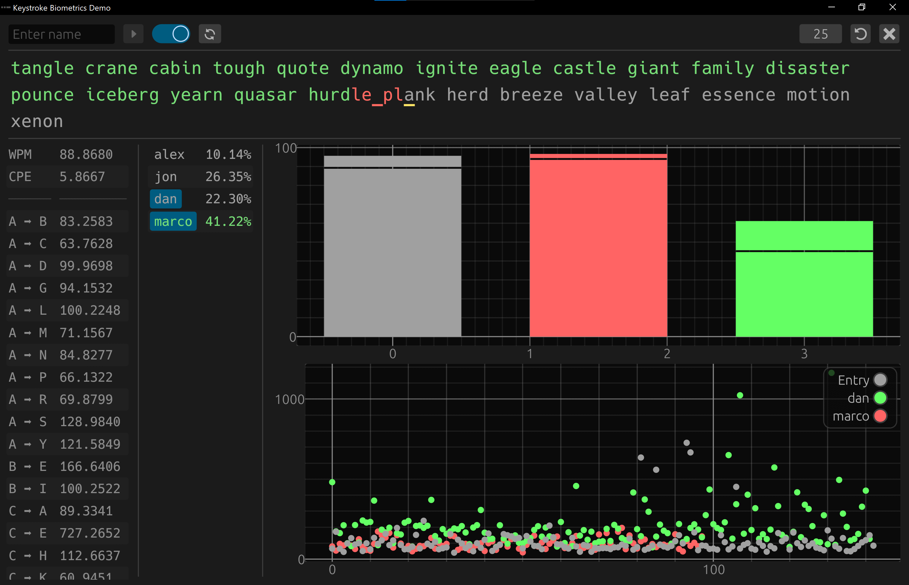

  <h1>Keystroke Biometrics</h1>
  
<em>rudimentary user identification via typing dynamics</em>

  
  
  

---

Built to demonstrate understanding of databases for a class in school. Keystroke dynamics are being further explored for an NLP class in the [kdnlp](https://github.com/nnmarcoo/kdnlp) repository. <i>This</i> project directly compares flight time, WPM, and CPE against stored profiles in a MySQL database to identify who is typing. Built to learn [Diesel ORM](https://diesel.rs/) and [MySQL](https://dev.mysql.com/).

  

---

## Metrics

- **Flight time** — time elapsed between consecutive keystrokes
- **WPM** — words per minute; typing speed
- **CPE** — corrections per entry; ratio of corrections to characters typed

## Build

**Requirements**

- [Rust](https://www.rust-lang.org/tools/install)
- [Diesel CLI](https://diesel.rs/guides/getting-started)
- [MySQL](https://dev.mysql.com/)

After running `diesel setup`, run `cargo run`. The database URL is hardcoded as `mysql://root@localhost/keys`. A local MySQL instance (e.g. [XAMPP](https://www.apachefriends.org/download.html)) must use [this schema](https://github.com/nnmarcoo/keystroke-biometrics/blob/main/migrations/2024-10-06-144846_keys/up.sql).

**Windows — MySQL dependency issues**

If the build fails to locate MySQL libraries, set these environment variables:

  
Variables

  <code>DEP_MYSQLCLIENT_LIB_DIR = C:\Program Files\MySQL\MySQL Connector C 6.1\lib\vs14</code> 
  <code>MYSQLCLIENT_LIB_DIR = C:\Program Files\MySQL\MySQL Server 8.0\lib</code> 
  <code>MYSQLCLIENT_VERSION = 8.0</code> 
  <code>Path += C:\Program Files\MySQL\MySQL Server 8.0\bin</code>

---

*This is a demonstration. Accuracy improves significantly with more collected data.*
